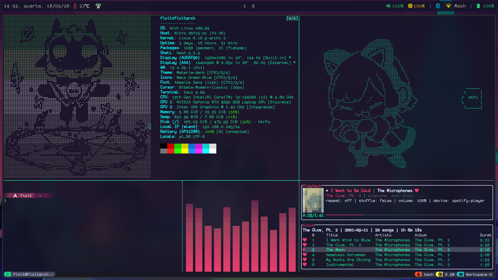
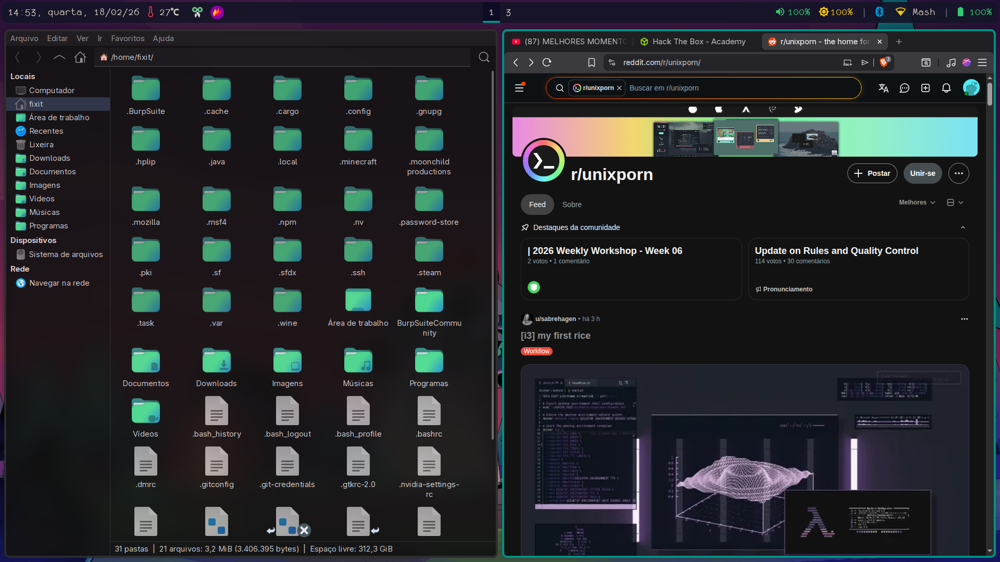
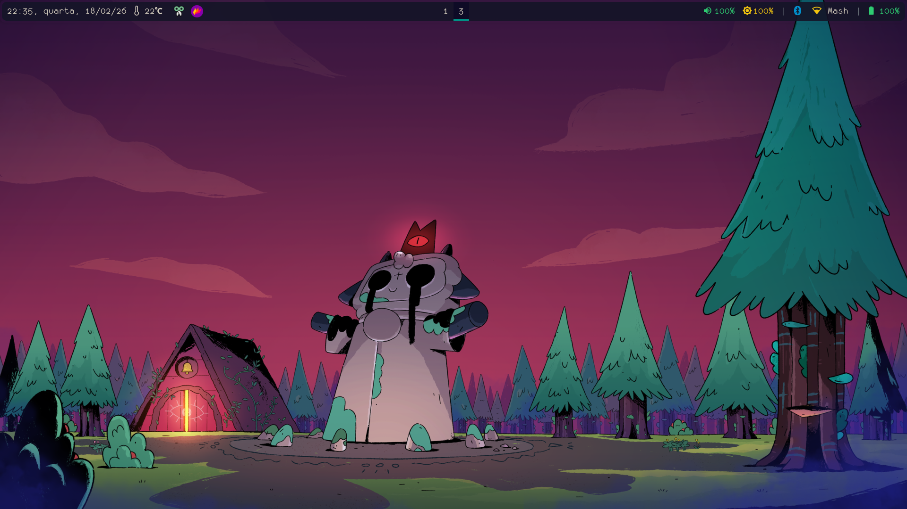
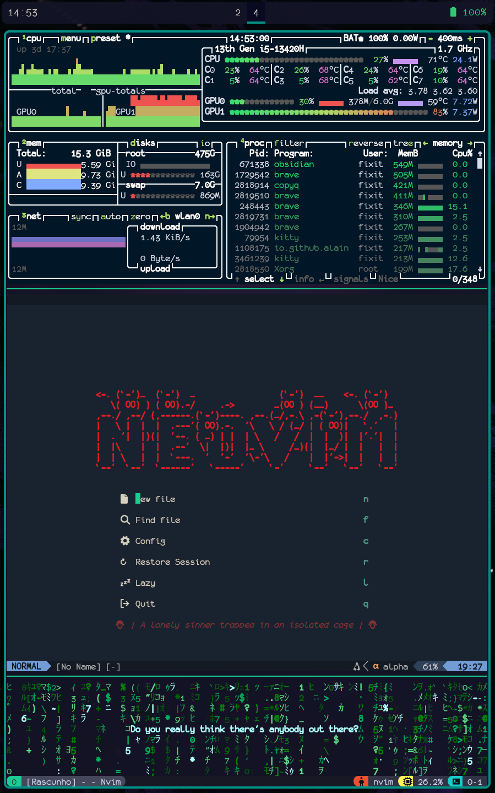
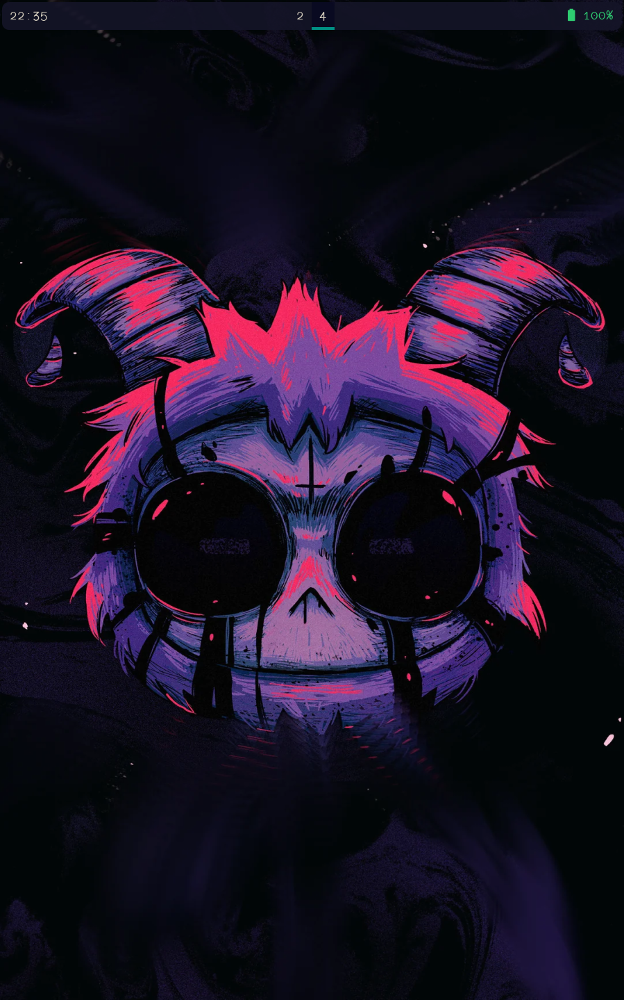

# Fixit-Dots

## Linux specifications

- **Distro:** [Arch Linux](https://archlinux.org/)
- **Tiling Window Manager:** [i3wm](https://i3wm.org/)
- **Greeter:** [lightdm](https://github.com/ubuntu/lightdm)
- **Bootloader:** [GRUB](https://ftp.gnu.org/gnu/grub/)

## Wallpapers

<https://wallpaperaccess.com/cult-of-the-lamb>

<https://www.reddit.com/r/CultOfTheLamb/comments/1kir8d0/backgrounds_for_your_phone/>

<https://www.reddit.com/media?url=https%3A%2F%2Fpreview.redd.it%2Flofi-lamb-wallpaper-v0-62s42feav1dd1.png%3Fwidth%3D1920%26format%3Dpng%26auto%3Dwebp%26s%3D4018f05c262c0f3288e1c2524516b1d221420898>

## Themes and fonts

- **GTK Theme:** [Materia GTK Theme by nana-4](<https://github.com/nana-4/materia-theme>)
- **Icon Theme:** [Macs Green-Blue by malvescardoso](<https://www.pling.com/p/2326868>)
- **Font:** [Monofur Nerd Font](<https://www.nerdfonts.com/font-downloads>)

## Applications

- **Terminal Emulator:** [kitty](https://github.com/kovidgoyal/kitty)
- **File Explorer:** [Thunar](https://gitlab.xfce.org/xfce/thunar)
- **Browser:** [Brave](https://www.brave.com)
- **Bar:** [Polybar](https://github.com/polybar/polybar)
- **Text Editor:** [neovim](https://github.com/neovim/neovim)

## Screenshots

## Other info

### Additional applications

- [tmux](https://github.com/tmux/tmux)
- [hyfetch](https://github.com/hykilpikonna/hyfetch) using [fastfetch](https://github.com/fastfetch-cli/fastfetch)
- [cava](https://github.com/karlstav/cava)
- [spotify_player](https://github.com/aome510/spotify-player)
- [momoisay](https://github.com/Mon4sm/momoisay)
- [btop](https://github.com/aristocratos/btop)
- [neo-matrix](https://github.com/st3w/neo)

### Files locations

- Place the ".tmux.conf" from the "dotfiles" directory, at the home directory, and rest from the same directory at the .config directory.
- Place the theme from the "grub-themes" at "/boot/grub/themes/" and configure grub to use it as the default theme.
- Place the scripts from the "scripts" directory at "/usr/local/bin/".
- Replace the "lightdm" directory at "/etc/lightdm/" with the "lightdm" one at the cloned repository directory.

#### Additional configuration

- **Polybar weather:** Inside "dotconfig/polybar/scripts/weather.sh", change the city name and the country code. You also need to configure the [OpenWeatherMap](openweathermap.org) API key at "~/.owm-key".
- **Spotify_player client:** Inside "dotconfig/spotify-player/app.toml", change the client id to your client id.
- **Starship:** Inside "~/.bashrc", add `eval "$(starship init bash)"` to the file (make sure it comes AFTER PS1) and source it with `source ~/.bashrc`.

### Additional credits

- [weather-polybar-plugin](https://github.com/GuidoFe/weather-polybar-plugin/weather.sh) (dotconfig/polybar/scripts)
- [alpha-nvim](https://github.com/goolord/alpha-nvim) (dotconfig/nvim/lua/plugins/alpha.lua)
- [nvim-autopairs](https://github.com/windwp/nvim-autopairs) (dotconfig/nvim/lua/plugins/autopairs.lua)
- [barbar.nvim](https://github.com/romgrk/barbar.nvim) (dotconfig/nvim/lua/plugins/barbar.lua)
- [nvim-colorizer.lua](https://github.com/norcalli/nvim-colorizer.lua) (dotconfig/nvim/lua/plugins/colorizer.lua)
- [nightfox.nvim](https://github.com/EdenEast/nightfox.nvim) (dotconfig/nvim/lua/plugins/colorscheme.lua)
- [Comment.nvim](https://github.com/numToStr/Comment.nvim) (dotconfig/nvim/lua/plugins/comment.lua)
- [FTerm.nvim](https://github.com/numToStr/FTerm.nvim) (dotconfig/nvim/lua/plugins/fterm.lua)
- [fzf-lua](https://github.com/ibhagwan/fzf-lua) (dotconfig/nvim/lua/plugins/fzf.lua)
- [lualine.nvim](https://github.com/nvim-lualine/lualine.nvim) (dotconfig/nvim/lua/plugins/lualine.lua)
- [LuaSnip](https://github.com/L3MON4D3/LuaSnip) (dotconfig/nvim/lua/plugins/luasnip.lua)
- [neoscroll.nvim](https://github.com/karb94/neoscroll.nvim) (dotconfig/nvim/lua/plugins/neoscroll.lua)
- [nvim-tree.lua](https://github.com/nvim-tree/nvim-tree.lua) (dotconfig/nvim/lua/plugins/nvim-tree.lua)
- [nvim-treesitter](https://github.com/nvim-treesitter/nvim-treesitter) (dotconfig/nvim/lua/plugins/treesitter.lua)
- [which-key.nvim](https://github.com/folke/which-key.nvim) (dotconfig/nvim/lua/plugins/which-key.lua)
- [Catppuccin tmux]() (~/dots/dotconfig/tmux/plugins/catppuccin/)
- [tmux-cpu](https://github.com/tmux-plugins/tmux-cpu) (~/dots/dotconfig/tmux/plugins/tmux-cpu/)
- [tmux-prefix-highlight](https://github.com/tmux-plugins/tmux-prefix-highlight) (~/dots/dotconfig/tmux/plugins/tmux-prefix-highlight/)
- [tmux-resurrect](https://github.com/tmux-plugins/tmux-resurrect) (~/dots/dotconfig/tmux/plugins/tmux-resurrect/)
